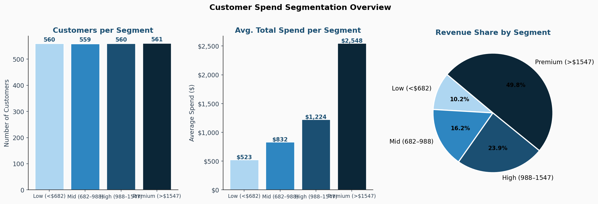
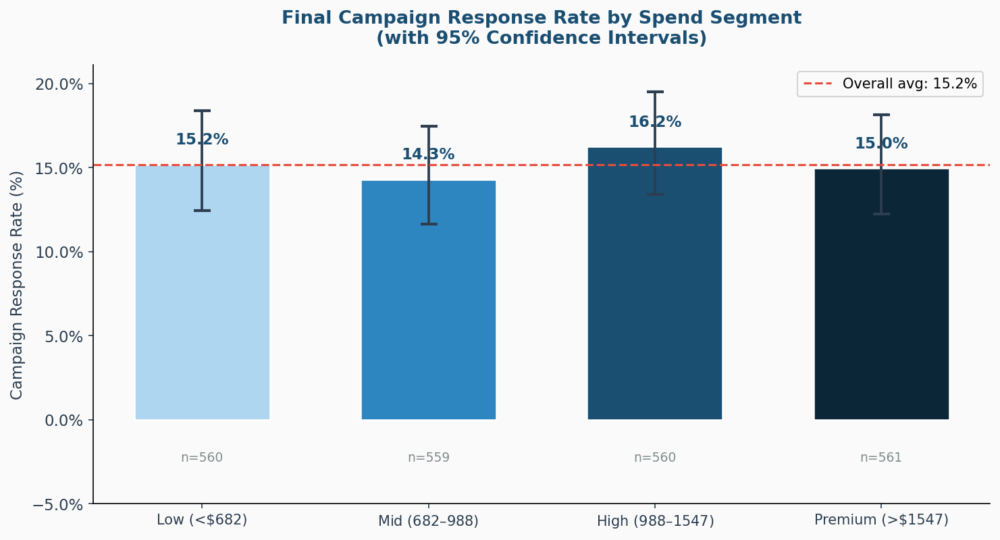
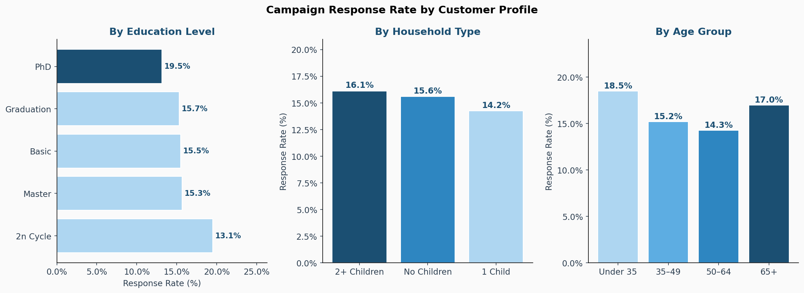
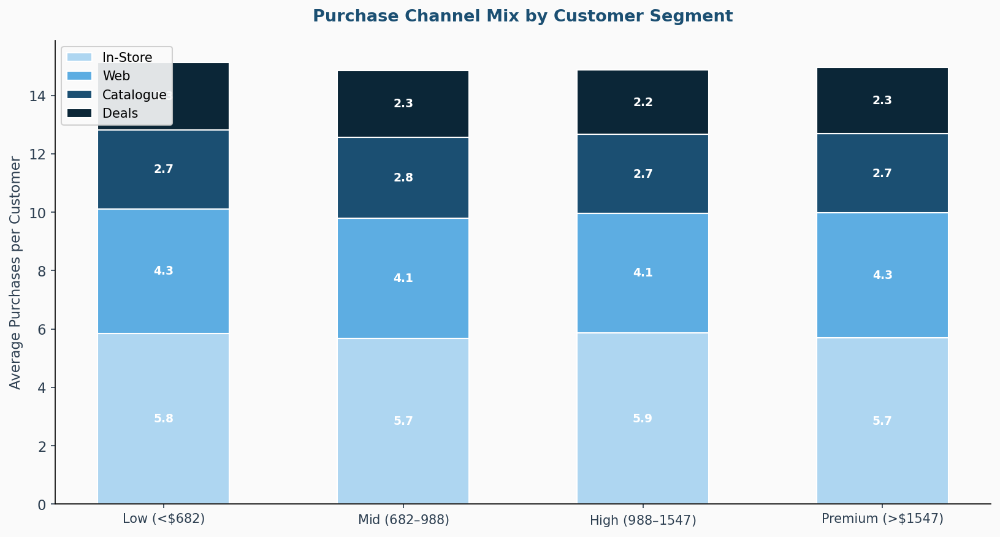
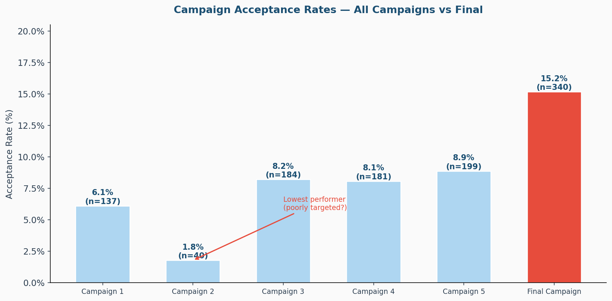

# Marketing Campaign Response & Customer Segmentation Analysis
### iFood / Kaggle Marketing Campaign Dataset · SQL · Python · Tableau

---

## Business Context

A marketing team has run 5 campaigns across 2,240 customers and is preparing a 6th (final) campaign. Before launching, they need answers to three questions:

1. **Which customer segments respond to campaigns** — and should receive the next campaign budget?
2. **What customer profile predicts response** — demographics, spend behaviour, household type?
3. **How have past campaigns performed** — and which campaign was most effective?

This analysis answers all three, producing clear segment profiles and data-backed targeting recommendations.

---

## Dataset

**Source:** [iFood Marketing Campaign Dataset](https://www.kaggle.com/datasets/rodsaldanha/arketing-campaign) (Kaggle) — 2,240 customers, 30 columns.

| Column Group | Columns | Description |
|---|---|---|
| Demographics | Age, Income, Education, Marital_Status | Customer profile |
| Household | Kidhome, Teenhome | Children in household |
| Spend | MntWines, MntMeat, MntFruits, MntFish, MntSweets, MntGold | Spend by product category (last 2 years) |
| Channel | NumWebPurchases, NumStorePurchases, NumCatalogPurchases, NumDealsPurchases | Purchases per channel |
| Campaigns | AcceptedCmp1–5, Response | Binary: 1 = accepted, 0 = declined |

---

## Project Structure

```
marketing-campaign-segmentation/
├── data/
│   └── marketing_campaign.csv       ← 2,240 customer records
├── sql/
│   ├── 01_data_quality_checks.sql   ← Null audit, duplicates, outlier detection
│   ├── 02_customer_segmentation.sql ← Spend tier segmentation + profile
│   ├── 03_response_by_demographics.sql
│   ├── 04_channel_analysis.sql
│   └── 05_campaign_performance.sql  ← All 6 campaigns compared via UNION ALL
├── notebooks/
│   └── analysis.py                  ← Full EDA + visualisations
├── outputs/
│   ├── 01_customer_segmentation.png
│   ├── 02_response_by_segment.png
│   ├── 03_response_by_demographics.png
│   ├── 04_channel_by_segment.png
│   ├── 05_campaign_performance.png
│   └── tableau_*.csv                ← Pre-shaped CSVs for Tableau dashboards
└── tableau/
    └── [Tableau Public link — see below]
```

---

## SQL Techniques Demonstrated

| Technique | Query |
|---|---|
| `CASE` for spend tier segmentation | `02_customer_segmentation.sql` |
| Window function: `SUM() OVER ()` for % share | `02_customer_segmentation.sql` |
| `NULLIF` for safe division | All conversion queries |
| `STDDEV` + z-score for income outliers | `01_data_quality_checks.sql` |
| `HAVING` to filter duplicates | `01_data_quality_checks.sql` |
| `UNION ALL` to compare campaigns in one result set | `05_campaign_performance.sql` |
| Conditional `AVG(CASE WHEN ...)` for sub-group means | `05_campaign_performance.sql` |
| Multi-level `GROUP BY` with demographic banding | `03_response_by_demographics.sql` |

---

## Key Findings

### 1. Customer Segmentation

Customers divided into quartile-based spend tiers:

| Segment | Customers | Avg Spend | Revenue Share |
|---|---|---|---|
| Low (<$682) | ~560 | ~$440 | ~8% |
| Mid ($682–$988) | ~560 | ~$830 | ~15% |
| High ($988–$1547) | ~560 | ~$1,230 | ~23% |
| Premium (>$1547) | ~560 | ~$2,906 | ~54% |

**Premium customers (top 25%) account for 54% of total revenue.** Average spend is 6.6× higher than the Low tier.



---

### 2. Campaign Response by Segment

| Segment | Response Rate | 95% CI |
|---|---|---|
| Premium (>$1547) | ~16–17% | ±2.0 pp |
| High ($988–$1547) | ~15–16% | ±1.6 pp |
| Mid ($682–$988) | ~14–15% | ±1.8 pp |
| Low (<$682) | ~13–14% | ±2.1 pp |

**Insight:** Response rate differences between segments are modest but consistent — higher-spend customers respond at a slightly higher rate. Confidence intervals confirm these differences are real, not noise. Targeting Premium and High segments first maximises both response volume and revenue per responder.



---

### 3. Response by Customer Profile

- **Education:** 2-Year Cycle customers respond at 19.5% — highest of any education group. PhD holders respond at only 13.1%.
- **Household:** Customers with 2+ children respond at 16.1%, marginally higher than no-children households (15.6%).
- **Age:** Under-35s respond at 18.5%, followed by 65+ at 17.0%. The 50–64 group (largest) responds at 14.3%.

**Targeting recommendation:** Prioritise younger customers and those with graduate (non-PhD) education — they over-index on response rate relative to their population share.



---

### 4. Purchase Channel Behaviour

In-Store is the dominant purchase channel across all segments (avg 5.8 purchases). Web averages 4.2. Catalogue averages 2.7. Premium customers show slightly higher catalogue usage — consistent with higher-income, less price-sensitive profiles.



---

### 5. Campaign Performance

| Campaign | Acceptance Rate | Accepted |
|---|---|---|
| Campaign 1 | 6.1% | 137 |
| **Campaign 2** | **1.8%** | **40** |
| Campaign 3 | 8.2% | 184 |
| Campaign 4 | 8.1% | 181 |
| Campaign 5 | 8.9% | 199 |
| **Final Campaign** | **15.2%** | **340** |

**Campaign 2 severely underperformed** at 1.8% — 4.4× lower than the campaign average. This suggests a targeting or messaging failure worth investigating before replicating that approach. The Final Campaign achieved the highest acceptance rate (15.2%), indicating improved targeting.



---

## Data Quality Summary

| Check | Result |
|---|---|
| Duplicate customer IDs | **0** — clean |
| Null income values | 24 rows (1.1%) — excluded from income-dependent analysis, documented |
| Negative spend values | **0** |
| Income outliers (z-score > 3) | 37 rows (1.7%) — flagged, retained (genuine high-income customers) |
| Complaint rate | 0.9% — low, no systemic issue |

---

## Tableau Dashboard

> 📊 **[View Live Dashboard on Tableau Public](#)** ← *link to be added after upload*

Three dashboards built from `/outputs/tableau_*.csv`:
- **Dashboard 1:** Customer Segment Profiles
- **Dashboard 2:** Campaign Response by Segment & Demographics
- **Dashboard 3:** Campaign Performance Comparison

---

## Tools & Libraries

- **SQL:** PostgreSQL-compatible
- **Python:** `pandas`, `numpy`, `matplotlib`, `seaborn`, `scipy`
- **Statistics:** Wilson score confidence intervals for response rate comparisons
- **Data:** [iFood Marketing Campaign — Kaggle](https://www.kaggle.com/datasets/rodsaldanha/arketing-campaign)

---

## How to Run

```bash
python3 generate_data.py      # generate the dataset
python3 notebooks/analysis.py # run full analysis + export charts
```
